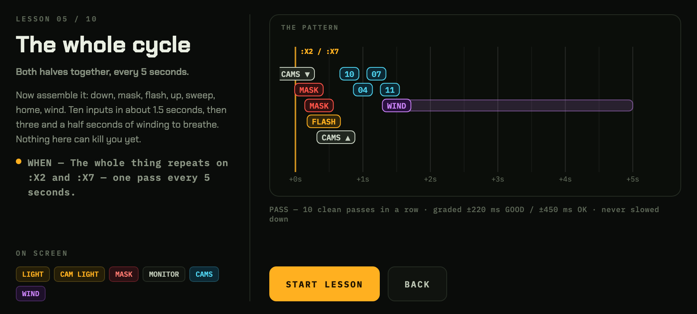

# Minus 7 Trainer

A touch-first browser trainer for the **Minus 7** strategy in *Five Nights at Freddy's 2*'s
10/20 mode. It is not a clone of the game: it is a drill machine for the input routine, built on a
reimplementation of the mechanics the strategy actually depends on.

Open it on a phone, turn sideways, and work down the lessons.



## What Minus 7 is

Flashing a camera freezes everyone in that room for 6.66 seconds. All seven stallable animatronics
have to pass through **CAM 10**, **CAM 04** or **CAM 07**, so a flash sweep every five seconds holds
all of them for the whole night. Foxy, Golden Freddy and Balloon Boy can't be stalled and are
handled by hand.

The core loop, on every time ending in **2** or **7**:

> cams down → mask flick → flash the hall → cams up → CAM 10 → CAM 04 → CAM 07 → CAM 11 → wind

Ten inputs in about 1.5 seconds, then three and a half seconds of winding. Full mechanical detail,
with sources, is in [MINUS-7-STRATEGY.md](MINUS-7-STRATEGY.md).

Strategy by **Niko Frost** (13 December 2023). This repo is a practice tool, not the strategy.

## Why a trainer

Minus 7 has no unwinnable RNG — every loss is a mechanical mistake. That makes it exactly the kind
of skill a drill machine can teach, and exactly the kind that is miserable to learn inside a
7-minute run where one slip ends the night.

## The lessons

Ten steps, each adding one thing and hiding every control it doesn't need:

| # | Lesson | Adds |
|---|---|---|
| 1 | The beat | tapping on `:X2` / `:X7`, nothing else on screen |
| 2 | The sweep | CAM 10 / 04 / 07 with the camera light |
| 3 | Sweep, then wind | CAM 11 and the hold-drag to WIND |
| 4 | Down and back | the office half: cams down, mask, hall flash, up |
| 5 | The whole cycle | both halves, nothing lethal |
| 6 | The cycle, for real | Foxy and Golden Freddy live |
| 7 | Hearing Balloon Boy | cams down across every 5s interval |
| 8 | The duel | the ~0.7s reaction window after his leaving bang |
| 9 | Full night | 7:00, real RNG |
| 10 | Worst luck | every roll pinned to the worst case |

Each needs N clean passes in a row to unlock the next. A rhythm lane shows the upcoming inputs
scrolling toward a hit line with their tolerance windows, the control you should touch next gets a
ring, and every input is graded in milliseconds.

Every screen is a night-shift console: phosphor amber on warm black, and anything you are timed on
— clock, offsets, stun bars, the lane — set in mono with tabular figures, so a digit never shifts
under your eye. Each control keeps one colour everywhere it appears: the chip on the lesson brief,
the glyph on the rhythm lane and the button under your thumb all agree. `How it works` is the whole
strategy on one board — the ten-input pass, why the 6.66 s stun never lapses, the three rooms, and
what has to be handled by hand.

The two faces, **Chakra Petch** and **IBM Plex Mono**, ship with the repo as latin-subset woff2 in
`assets/fonts/` (both SIL OFL), so the trainer looks right on a phone with no internet.

**Timing is never slowed down.** The whole skill is absolute timing, so practising at 0.8× would
build the wrong reflexes. Lessons get easier by removing controls and threats, never by distorting
the clock — only the grading tolerance is loosened early on.

## Calibration

Button placement is the point of a touch trainer, so every control — all 12 cameras, both lights,
mask, monitor, vents and wind — can be dragged to move and resized by its corner handle.

`Settings → Calibrate layout` opens an inert session with the simulation stopped and game input
disabled, so dragging a control never doubles as pressing it. Overlapping controls are flagged red,
because overlapping touch targets silently swallow inputs.

`Settings → Save this layout as the code default` posts the layout to the dev server, which writes
it into `src/config.js` and rebuilds. Anywhere else, it hands you the JSON.

The shipped camera map is traced from a screenshot of the real in-game map and sized to that
image's aspect ratio, so the thumb path between 11 / 10 / 04 / 07 matches the game.

## Sound

Cues are synthesised — no audio files ship with this repo. Each control has its own pitch, so a
correct cycle has a recognisable tune and a wrong one is audibly wrong. There is an optional
metronome on the `:X2` / `:X7` anchors and haptic feedback on every input.

If you own FNaF 2 you can load sounds from your own copy into `Settings → Your own sounds`. They are
stored in IndexedDB on your device, are never uploaded, and are not part of the page. **No game
assets are distributed here.**

## Running it

No dependencies, no build step for development:

```sh
python3 tools/serve.py 8731      # serves the repo, and accepts saved layouts
```

Then open `http://<your-ip>:8731/index.html` on your phone, on the same network. The source runs
directly as ES modules — there is nothing to build for development.

For a single self-contained file (one HTML with every module, the CSS and the fonts inlined,
nothing external):

```sh
python3 tools/build.py           # -> dist/index.html
```

`dist/` is not committed. The bundler derives module order from the imports, so adding a file needs
no list to be updated.

Note that a plain-`http` LAN URL is not a secure context, so wake lock and vibration are disabled.

## Tests

All headless, all dependency-free — the browser ones drive Chrome over the DevTools Protocol
(Node 22's built-in WebSocket), no Puppeteer.

```sh
node tools/simtest.mjs --sweep   # a perfect cycle vs. 200 seeds
node tools/bbtest.mjs 200        # ...including Balloon Boy; --worst for worst-luck
node tools/bbtest.mjs 60 --jitter=200   # how much lateness is survivable
node tools/lessontest.mjs        # drives the lesson ladder to a pass
node tools/caltest.mjs           # calibration, drag vs. press, layout saving
node tools/lightcheck.mjs        # the two lights swap with the monitor
node tools/browsertest.mjs       # load, input, report
```

What they establish:

- A correctly played cycle clears **200/200 seeds**, and **100/100 on worst luck**, with zero stun
  lapses — matching the community's claim that Minus 7 has no unwinnable RNG.
- The difficulty curve is real: survivable up to ~120 ms late, ~35% at 200 ms, dead past 300 ms.

## Accuracy

Mechanics come from the FNaF max-mode community's reverse engineering, not from the game's files —
constants are marked `[SOURCED]` or `[CALIBRATED]` in `src/config.js`, and the modelling
assumptions are called out in [MINUS-7-STRATEGY.md](MINUS-7-STRATEGY.md). Post-chokepoint routing is
an approximation: it only runs once you have already broken the stun loop.

## Licence

MIT, for this code. The bundled fonts are under the SIL Open Font License 1.1 — see
`assets/fonts/`. *Five Nights at Freddy's 2* is © Scott Cawthon; no game assets are included.
